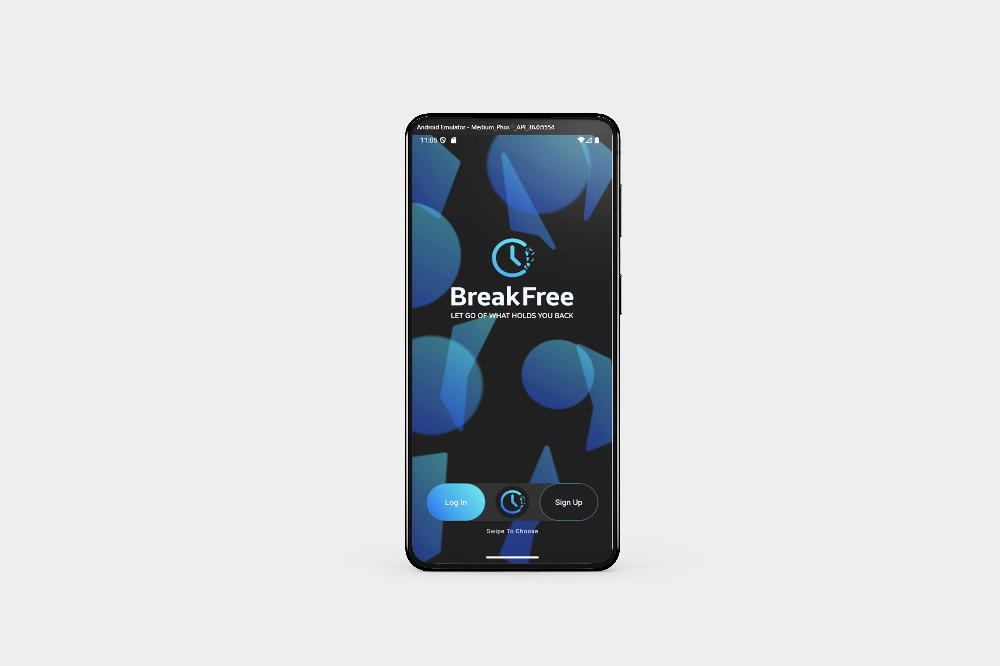
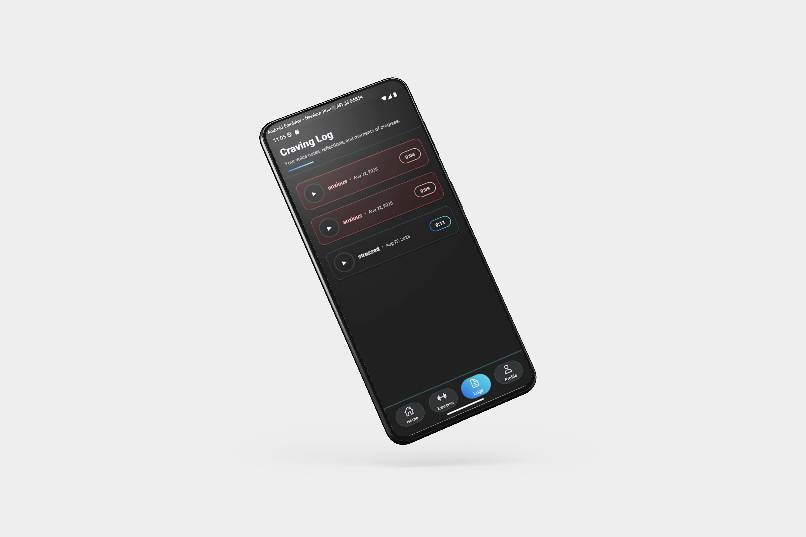

<a id="readme-top"></a>

<!-- PROJECT SHIELDS -->
[](https://github.com/JoshuaDeKlerk/BreakFree/graphs/contributors)
[](https://github.com/JoshuaDeKlerk/BreakFree/network/members)
[](https://github.com/JoshuaDeKlerk/BreakFree/stargazers)
[](https://github.com/JoshuaDeKlerk/BreakFree/issues)
[](https://opensource.org/licenses/MIT)

---

## Table of Contents

- [About BreakFree](#about-breakfree)
- [Built With](#built-with)
- [How To Install](#how-to-install)
  - [Step 1: Clone the Repository](#step-1-clone-the-repository)
  - [Step 2: Open the Project Directory](#step-2-open-the-project-directory)
  - [Step 3: Install Dependencies](#step-3-install-dependencies)
  - [Step 4: Environment Setup](#step-4-environment-setup)
  - [Step 5: Running Locally](#step-5-running-locally)
- [Features](#features)
- [The Idea](#the-idea)
- [Development Process](#development-process)
  - [Highlights](#highlights)
  - [Challenges](#challenges)
- [Future Implementations](#future-implementations)
- [Mockups](#mockups)
- [License](#license)
- [Contributing](#contributing)
- [Authors](#authors)
- [Contact](#contact)
- [Acknowledgements](#acknowledgements)

<p align="right"><a href="#readme-top">[⬆️ Back to top]</a></p>

---

# About BreakFree

**BreakFree – “Let go of what holds you back.”**  
BreakFree is a mobile app designed to help users break free from compulsive habits, starting with vaping. Instead of rigid schedules or guilt-based approaches, BreakFree uses **time-awareness, emotional support, and a button-free UI** to guide users through cravings.  

Built on **gesture-based interactions** and a **calming circular timer**, the app tracks progress, celebrates milestones, and provides real-time interventions such as breathing exercises, motivational playback, and voice journaling

---

## Built With

<p align="left">
  <a href="https://reactnative.dev/"></a>
  <a href="https://expo.dev/"></a>
  <a href="https://firebase.google.com/"></a>
  <a href="https://docs.swmansion.com/react-native-gesture-handler/"></a>
  <a href="https://docs.swmansion.com/react-native-reanimated/"></a>
  <a href="https://docs.expo.dev/versions/latest/sdk/av/"></a>
  <a href="https://docs.expo.dev/versions/latest/sdk/haptics/"></a>
</p>

---


## How To Install

### Step 1: Clone the Repository

```bash
git clone https://github.com/JoshuaDeKlerk/BreakFree
```

### Step 2: Open the Project Directory

If using the terminal:
```bash
cd BreakFree
```
If using GitHub Desktop, the folder should be opened automatically in your editor after cloning.

### Step 3: Install Dependencies

```bash
npm install
```

### Step 4: Environment Setup

Create a `.env` file in the root directory. Below is an example template—**do not use the actual keys from our deployment**:

```env
EXPO_PUBLIC_FIREBASE_API_KEY=your_api_key
EXPO_PUBLIC_FIREBASE_AUTH_DOMAIN=your_project.firebaseapp.com
EXPO_PUBLIC_FIREBASE_PROJECT_ID=your_project_id
EXPO_PUBLIC_FIREBASE_STORAGE_BUCKET=your_project.appspot.com
EXPO_PUBLIC_FIREBASE_MESSAGING_SENDER_ID=your_sender_id
EXPO_PUBLIC_FIREBASE_APP_ID=your_app_id
```

### Step 5: Running Locally

```bash
npx expo start
```

---

## Features

| Feature                      | Description |
|---------------------------|-------------|
| **Craving Clock**       | Circular timer that tracks time since last vape, reinforcing streaks. |
| **Money Saved**   | Calculates how much money is saved by not vaping. |
| **Voice Journaling**         | Users log cravings through voice notes with emotion awareness.|
| **Streaks & Insights**                  | Tracks milestones and identifies patterns like trigger times. |
| **Gesture Navigation**            | Entire app is gesture-based—no traditional buttons. |
| **Calm Onboarding**         | Button-free, interactive, supportive onboarding flow. |
| **Haptic Breathing Guide**     | Helps users manage cravings through guided haptic breathing. |
| **Motivational Playback**     | User can listen to past voice notes. |


<p align="right"><a href="#readme-top">[⬆️ Back to top]</a></p>

---
## The Idea

BreakFree’s mission is to provide a judgment-free, calming, and supportive digital companion for young adults trying to quit vaping. It combines behavioral science techniques (progress tracking, rewards, coping strategies) with human-centric design (gestures, emotion-aware responses)

---

## Development Process

### Highlights
- 🌀 **Buttonless Design:** Gesture-first interactions (swipe, hold, tap-and-hold).
- 🎙️ **Voice Journaling:** Low-barrier craving logging with sentiment detection.
- 🔄 **Realtime Data:** Firebase handles streaks, logs, and syncing across devices.

### Challenges
- 🔐 Ensuring privacy for sensitive craving logs and voice notes.
- ♿ Making a gesture-heavy interface accessible for all users.
- 🧩 Maintaining usability with a no-button constraint.
- 🌍 Extending beyond vaping to other habits in the future.

<p align="right"><a href="#readme-top">[⬆️ Back to top]</a></p>

---

## Future Implementations

- 🌱 Milestones, streak celebrations, and motivational playback.
- 💬 AI habit coach for personalized tips.
- 🧑‍🤝‍🧑 Optional community support features.
- 📊 Eventual expansion to track multiple habits.
- 🕹️ 3D visualizations or companion avatar for gamification.
- 📱 Push notifications for encouragement & reminders.


<p align="right"><a href="#readme-top">[⬆️ Back to top]</a></p>

---

## Usage

After launching **BreakFree**, users can:

- **Complete calm onboarding**  
  Learn the gesture-first UI (no traditional buttons): swipe to navigate, press‑and‑hold to confirm.

- **Check the Craving Clock**  
  See a circular timer counting time since the last vape. Milestones and streaks update automatically.

- **Log a craving (voice-first)**  
  Swipe to the Journal, **press‑and‑hold to record** how you feel (e.g., “stressed/bored”). Release to save.

- **Use the Breathing Exercise**  
  Use a **Haptic Breathing** guide (inhale/hold/exhale).

- **Track money saved**  
  Set your weekly spend once; the **Money Saved** card updates as your streak grows.

- **Navigate by gestures**  
  - Press‑and‑hold: confirm actions / start recording  

- **Privacy-first**  
  Your entries and voice notes are tied to your account and secured via Firebase Auth & rules.

_For more screenshots, see the [Mockups](#mockups) section._

<p align="right"><a href="#readme-top">[⬆️ Back to top]</a></p>
---

## Mockups

Below are UI mockups that guided the design and development of **BreakFree**:

### Welcome Page


### Login Page


### Sign Up Page


### Home Page


### Exercise Page


### Logs Page


### Profile Page


### Modals


<p align="right"><a href="#readme-top">[⬆️ Back to top]</a></p>

---

## Other Resources

### 🔧 Development & Documentation

- [Frontend Repo](https://github.com/JoshuaDeKlerk/BreakFree) – Main React Native + Expo project.

- **Environment Variable Template:**

```bash
EXPO_PUBLIC_FIREBASE_API_KEY=your_api_key
EXPO_PUBLIC_FIREBASE_AUTH_DOMAIN=your_project.firebaseapp.com
EXPO_PUBLIC_FIREBASE_PROJECT_ID=your_project_id
EXPO_PUBLIC_FIREBASE_STORAGE_BUCKET=your_project.appspot.com
EXPO_PUBLIC_FIREBASE_MESSAGING_SENDER_ID=your_sender_id
EXPO_PUBLIC_FIREBASE_APP_ID=your_app_id
```

<p align="right"><a href="#readme-top">[⬆️ Back to top]</a></p>

---

## License

MIT © BreakFree. You are free to use, modify, and distribute this project under the conditions of the MIT license.

---

## Contributing

Contributions are welcome! If you'd like to help improve BreakFree:

1. Fork the repo
2. Create a new branch (`git checkout -b feature/NewFeature`)
3. Commit your changes (`git commit -m 'Add new feature'`)
4. Push to the branch (`git push origin feature/NewFeature`)
5. Open a pull request


---

### Author

<a href="https://github.com/JoshuaDeKlerk">
  
  <br/>
  <sub><b>Joshua De Klerk</b></sub>
</a>

---

## Contact

📧 [Joshua De Klerk](mailto:231207@virtualwindow.co.za)  

<br/>

📁 [App Repo](https://github.com/JoshuaDeKlerk/BreakFree)  

---

## Report Issues

- 💡 [Request a Feature or Report a bug](https://github.com/JoshuaDeKlerk/BreakFree/issues/new)


---

## Acknowledgements

- **[Armand Pretorius](https://github.com/Armand-OW)** – Lecturer and project supervisor from Open Window, School of Creative Technologies.  
- [Stack Overflow](https://stackoverflow.com/) – For troubleshooting and community support.  
- [Figma](https://www.figma.com/) – Used for wireframing, user flows, and interface prototyping.  
- [Expo](https://expo.dev/) – Core toolchain for cross-platform mobile development.  
- [Firebase](https://firebase.google.com/) – Authentication, Firestore, Storage, and hosting services.  
- [React Native Reanimated](https://docs.swmansion.com/react-native-reanimated/) & [Gesture Handler](https://docs.swmansion.com/react-native-gesture-handler/) – For custom animations and gesture-based navigation.  
- [Expo Haptics](https://docs.expo.dev/versions/latest/sdk/haptics/) – For tactile breathing guidance and feedback.  
- [Expo AV](https://docs.expo.dev/versions/latest/sdk/av/) – For voice journaling and audio playback.  
- [Three.js / React Three Fiber](https://docs.pmnd.rs/react-three-fiber/getting-started/introduction) – (Planned) for 3D motivational visualizations.  

<p align="right"><a href="#readme-top">[⬆️ Back to top]</a></p>

---